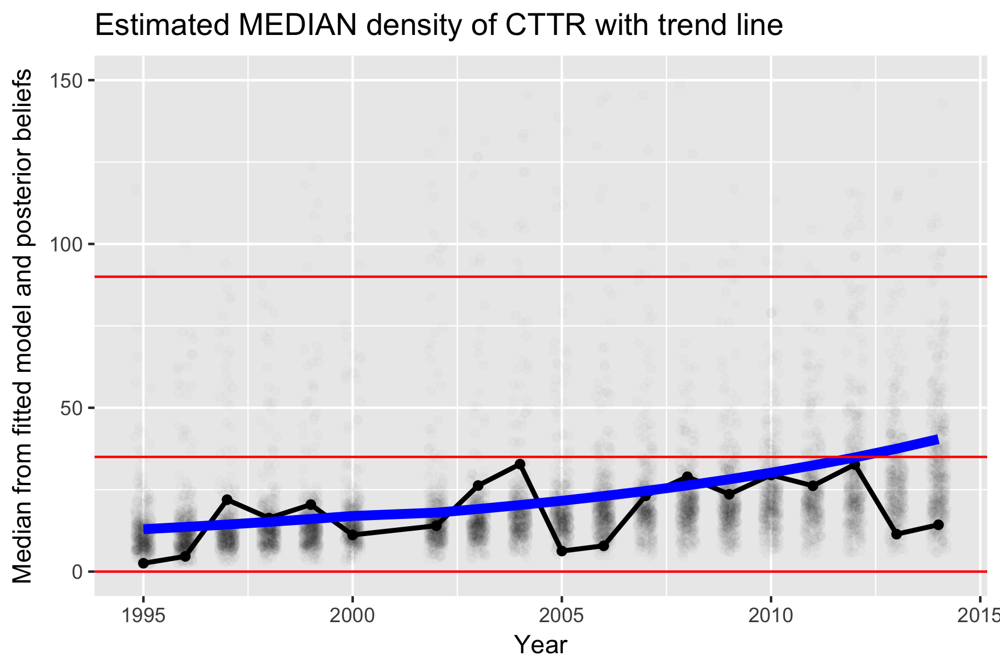

```{r setup, include=FALSE}
knitr::opts_chunk$set(echo = FALSE)
```


# Objectives 

- Create a draft Watershed Assessment Report
- How many sample locations do I need in the watershed to detect a trend?
- What is impact of stratification of samples in a watershed


# Workflow

- use _R_ and _RMarkdown_ to do computations and create _MSWord_ (or other format) draft
documents that can be edited to create final report


# Why this approach?

- Reproducible output. 
- Final output and data are easy to syncronize.
- Reduce amount of copying and pasting output from _R_ to _MSWord_.

But

- You can only get 90% of the way to the final report but need some customization
unless you go to the next level of _RMarkdown_ using _LaTeX_ (a professional typesetting program).


# Computer Preparation

- Install _R_ and associated packages.  
  Caution with _ggmaps_ as current version doesn't talk nicely with Google Maps. 
  You will need to install from GitHub

- Install _RStudio_ and associated _R_ packages.
- Install _JAGS_ and associated _R_ packages.


- Get FWIS data for your watershed.  
  We will use Quirk Creek as an example.
  
- Download material from GitHub   
  Visit <https://github.com/cschwarz-stat-sfu-ca/ABgov-fish>  
  Download zip file.  
  Unzip zip file and discard zip file. 


-----

Watershed Assessment

  
# Watershed Assessment

Take this:
```{r, out.height="5in",echo=FALSE, include=FALSE, message=FALSE, warning=FALSE, fig.align='center',dpi=300}
library(ggplot2)
library(coda)
library(pander)
library(plyr)
library(R2jags)  # used for call to JAGS
library(reshape2)


# Get the FSI category boundaries
# Read the FSI Thresholds
FSI.threshold.csv<- textConnection(
"Species.Code, FSI.num.cat, FSI.cat, lower, upper
BKTR, 1, VHR,   0,   35
BKTR, 2,  HR,  35,  90
BKTR, 3,  MR,  90, 120
BKTR, 4,  LR, 120, 170
BKTR, 5, VLR, 170, 3000")

FSI.threshold <- read.csv(FSI.threshold.csv, header=TRUE, as.is=TRUE, strip.white=TRUE)
FSI.cat.unique <- unique(FSI.threshold[,c("FSI.num.cat","FSI.cat")])
FSI.threshold$FSI.cat <- factor( FSI.threshold$FSI.cat, 
                        levels= FSI.cat.unique$FSI.cat[order(FSI.cat.unique$FSI.num.cat)], order=TRUE)


# Make the simulated data
set.seed(23434543)
stream1.cpue <- data.frame(Stream="Stream 1",
                           cpue = round(rlnorm(10, meanlog=log(35), sdlog=.3 ),1))
stream2.cpue <- data.frame(Stream="Stream 2",
                           cpue = round(rlnorm(10, meanlog=log(35), sdlog= .7 ),1))
cpue <- rbind(stream1.cpue, stream2.cpue)

med.cpue <- plyr::ddply(cpue, "Stream", plyr::summarize,
                      med.cpue=median(cpue),
                      med.cpue.lcl=exp( mean(log(cpue))-1.96*sd(log(cpue))/sqrt(length(cpue))),
                      med.cpue.ucl=exp( mean(log(cpue))+1.96*sd(log(cpue))/sqrt(length(cpue))))


# This comes from the Ghost_Quirk_compiledCPUE_AllSpp.xlsx file
Quirk.csv <- textConnection(
"Watershed   ,  HUC   ,  Waterbody Name   ,  Year   ,  Site No   ,  UTM11U_E   ,  UTM11U_N   ,  BKTR   ,  CTTR   ,  BLTR
Quirk   ,  12   ,  Quirk   ,  1995   ,  LW   ,  657209   ,  5631652   ,  2.60   ,  0.40   ,  0.00
Quirk   ,  12   ,  Quirk   ,  1996   ,  LW   ,  657209   ,  5631652   ,  7.80   ,  1.00   ,  0.00
Quirk   ,  12   ,  Quirk   ,  1997   ,  LW   ,  657209   ,  5631652   ,  28.00   ,  8.60   ,  0.60
Quirk   ,  12   ,  Quirk   ,  1998   ,  LW   ,  657209   ,  5631652   ,  30.40   ,  6.00   ,  0.40
Quirk   ,  12   ,  Quirk   ,  1998   ,  UP   ,  660029   ,  5630056   ,  43.16   ,  6.32   ,  1.58
Quirk   ,  12   ,  Quirk   ,  1999   ,  LW   ,  657209   ,  5631652   ,  20.60   ,  3.20   ,  0.00
Quirk   ,  12   ,  Quirk   ,  1999   ,  UP   ,  660029   ,  5630056   ,  31.32   ,  4.74   ,  1.05
Quirk   ,  12   ,  Quirk   ,  2000   ,  LW   ,  657209   ,  5631652   ,  40.00   ,  7.60   ,  0.60
Quirk   ,  12   ,  Quirk   ,  2000   ,  UP   ,  660029   ,  5630056   ,  58.68   ,  15.26   ,  1.05
Quirk   ,  12   ,  Quirk   ,  2002   ,  LW   ,  657209   ,  5631652   ,  21.20   ,  2.20   ,  0.40
Quirk   ,  12   ,  Quirk   ,  2002   ,  UP   ,  660029   ,  5630056   ,  17.11   ,  1.58   ,  0.00
Quirk   ,  12   ,  Quirk   ,  2003   ,  LW   ,  657209   ,  5631652   ,  8.80   ,  16.20   ,  1.40
Quirk   ,  12   ,  Quirk   ,  2003   ,  UP   ,  660029   ,  5630056   ,  18.95   ,  5.00   ,  2.11
Quirk   ,  12   ,  Quirk   ,  2004   ,  LW   ,  657209   ,  5631652   ,  7.00   ,  7.40   ,  1.60
Quirk   ,  12   ,  Quirk   ,  2004   ,  UP   ,  660029   ,  5630056   ,  21.32   ,  11.32   ,  0.53
Quirk   ,  12   ,  Quirk   ,  2005   ,  LW   ,  657209   ,  5631652   ,  19.20   ,  8.60   ,  1.20
Quirk   ,  12   ,  Quirk   ,  2005   ,  UP   ,  660029   ,  5630056   ,  20.26   ,  12.37   ,  2.37
Quirk   ,  12   ,  Quirk   ,  2006   ,  LW   ,  657209   ,  5631652   ,  9.20   ,  2.00   ,  0.80
Quirk   ,  12   ,  Quirk   ,  2006   ,  UP   ,  660029   ,  5630056   ,  22.63   ,  6.84   ,  1.05
Quirk   ,  12   ,  Quirk   ,  2007   ,  LW   ,  657209   ,  5631652   ,  15.60   ,  10.20   ,  2.00
Quirk   ,  12   ,  Quirk   ,  2007   ,  UP   ,  660029   ,  5630056   ,  18.42   ,  18.16   ,  2.11
Quirk   ,  12   ,  Quirk   ,  2008   ,  LW   ,  657209   ,  5631652   ,  2.40   ,  6.40   ,  0.00
Quirk   ,  12   ,  Quirk   ,  2008   ,  UP   ,  660029   ,  5630056   ,  15.00   ,  12.37   ,  0.26
Quirk   ,  12   ,  Quirk   ,  2009   ,  LW   ,  657209   ,  5631652   ,  4.40   ,  7.00   ,  0.00
Quirk   ,  12   ,  Quirk   ,  2009   ,  UP   ,  660029   ,  5630056   ,  5.00   ,  8.42   ,  0.00
Quirk   ,  12   ,  Quirk   ,  2010   ,  LW   ,  657209   ,  5631652   ,  13.80   ,  6.80   ,  0.00
Quirk   ,  12   ,  Quirk   ,  2010   ,  UP   ,  660029   ,  5630056   ,  11.58   ,  10.79   ,  0.53
Quirk   ,  12   ,  Quirk   ,  2011   ,  LW   ,  657209   ,  5631652   ,  14.40   ,  13.60   ,  0.20
Quirk   ,  12   ,  Quirk   ,  2011   ,  UP   ,  660029   ,  5630056   ,  26.84   ,  22.89   ,  0.53
Quirk   ,  12   ,  Quirk   ,  2012   ,  LW   ,  657209   ,  5631652   ,  6.80   ,  6.20   ,  0.80
Quirk   ,  12   ,  Quirk   ,  2012   ,  UP   ,  660029   ,  5630056   ,  9.21   ,  5.53   ,  0.53
Quirk   ,  12   ,  Quirk   ,  2013   ,  LW   ,  657209   ,  5631652   ,  4.20   ,  3.80   ,  0.80
Quirk   ,  12   ,  Quirk   ,  2013   ,  UP   ,  660029   ,  5630056   ,  8.16   ,  4.74   ,  0.26
Quirk   ,  12   ,  Quirk   ,  2014   ,  LW   ,  657209   ,  5631652   ,  3.40   ,  3.40   ,  0.00
Quirk   ,  12   ,  Quirk   ,  2014   ,  UP   ,  660029   ,  5630056   ,  10.26   ,  2.11   ,  0.26")

pass <- read.csv(Quirk.csv, header=TRUE, as.is=TRUE, strip.white=TRUE)

pass.melt <- reshape2::melt(pass,
                            id.vars=c("Watershed","Year","Site.No"),
                            measure.vars=c("BKTR","CTTR","BLTR"),
                            variable.name="Species",
                            value.name="Density")
pass.melt$Species <- as.character(pass.melt$Species)
str(pass.melt)
# note that the data frame has density as fish/100m, but the standards are in 
# terms of fish/300m so we need to multiply by 3
pass.melt$Density <- pass.melt$Density*3


# add in all combinations of year and species so that plot "breaks" when data stops
all.year.species <- expand.grid(Year=min(pass.melt$Year,na.rm=TRUE):max(pass.melt$Year, na.rm=TRUE),
                                Species=unique(pass.melt$Species), 
                                Site.No=unique(pass.melt$Site.No), 
                                Watershed=unique(pass.melt$Watershed),stringsAsFactors=FALSE)
dim(pass.melt)
pass.melt <- merge(pass.melt, all.year.species, all=TRUE)
dim(pass.melt)
xtabs(~Species+Year, data=pass.melt, exclude=NULL, na.action=na.pass)


raw.trend <- ggplot2::ggplot(data=pass.melt, aes(x=Year, y=Density, color=Species, linetype=Site.No))+
   ggtitle(paste("Raw data for Quirk Creek with FSI categories",sep=""))+
   geom_point()+
   geom_line()+
   geom_hline(data=FSI.threshold, aes(yintercept=lower), alpha=0.2)+
   ylab("Density (fish/300 m2)")
#raw.trend


raw.trend.log <- ggplot2::ggplot(data=pass.melt, aes(x=Year, y=log(Density+.1), color=Species, linetype=Site.No))+
   ggtitle("Raw data for Quirk Creek with FSI categories")+
   geom_point()+
   geom_line()+
   geom_hline(data=FSI.threshold, aes(yintercept=log(lower+.1)), alpha=0.2)+
   ylab("log of Density (fish/300 m2)")
#raw.trend.log
```
```{r echo=FALSE, warning=FALSE, message=FALSE, dpi=300}
raw.trend
```

# Watershed Assessment II
```{r trend.model, echo=FALSE, message=FALSE, warning=FALSE, include=FALSE}
cat(file="model2.txt", "
    ############################################################
    # Input data
    #      Ndata  - number of data points
    #      Density- density for each data point
    #      Site.num- site number for each data point (1....NSites)
    #      Year.num- year number for each data point (1... Nyears)

    ############################################################

    # compute the number of years (1...) and number of sites
data {
       Nyears   <- max(Year.num)
       Nsites   <- max(Site.num)
     }    

model {
    
    # compute the trend line
    for(i in 1:Nyears){
          log.median.trend[i] <- beta0 + beta1*i
    }

    # add the site-effects and year-effects to the trend
    for(i in 1:Ndata){
       log.median.data[i] <- log.median.trend[Year.num[i]] + 
                     site.eff[Site.num[i]] +  
                     year.eff[Year.num[i]]
       Density[i] ~ dlnorm( log.median.data[i], tau)
    }

    # tau is 1/(sd.log * sd.log)
    tau <- 1/(sd.log*sd.log)
    sd.log ~ dunif(.05, 3)   # on the log-scale sd is proportion of the mean
    
    # priors for the intercept and slope
    beta0 ~ dnorm(0, .001)
    beta1 ~ dnorm(0, .001)

    # random effect of Year 
    for(i in 1:Nyears){
          year.eff[i] ~ dnorm(0, tau.year.eff)
    }
    tau.year.eff <- 1/(sd.year.eff*sd.year.eff)
    sd.year.eff  ~ dunif(.01,2)

    # random effect of Sites
    for(i in 1:Nsites){
          site.eff[i] ~ dnorm(0, tau.site.eff)
    }
    tau.site.eff <- 1/(sd.site.eff * sd.site.eff)
    sd.site.eff  ~ dunif(.01, 2)

    # what is the probability that the trend is negative
    p.beta1.lt.0 <- ifelse(beta1<0,1,0)

   # derived variables.
   for(i in 1:Nyears){
      med.den.trend [i] <- exp(log.median.trend  [i])
      med.den.data  [i] <- exp(log.median.data   [i])
   }

   # probability of being in a threshold category for trend line
   for(i in 1:Nyears){
      for(k in 1:NFSI){
          prob.FSI.cat.trend[i,k] <- ifelse((med.den.trend[i] >= FSI.lower[k]) && 
                                            (med.den.trend[i] <  FSI.upper[k]),1,0)
          prob.FSI.cat.data [i,k] <- ifelse((med.den.data [i] >= FSI.lower[k]) && 
                                            (med.den.data [i] <  FSI.upper[k]),1,0)
      }
   }
}
") # End of the model

pass.cttr <- pass.melt[ !is.na(pass.melt$Density) & pass.melt$Species=="CTTR",]

year.code <- data.frame(Year    =sort(unique(pass.cttr$Year)), 
                        Year.num=1:length(unique(pass.cttr$Year)))
#year.code
pass.cttr <- merge(pass.cttr, year.code)
head(pass.cttr)

# Convert Site.no to a unique numeric values
site.code <- data.frame(Site.No  =unique(pass.cttr$Site.No),
                        Site.num =1:length(unique(pass.cttr$Site.No)), 
                        stringsAsFactors=FALSE)
#site.code
pass.cttr <- merge(pass.cttr, site.code)


pass.cttr <- pass.cttr[ order(pass.cttr$Year.num, pass.cttr$Site.num),]


data.list <- list(Ndata      =nrow(pass.cttr),
                  Year.num   =pass.cttr$Year.num,
                  Year       =pass.cttr$Year,
                  Site.num   =pass.cttr$Site.num,
                  Density =pass.cttr$Density+.1*min(pass.cttr$Density[pass.cttr$Density>0]),
                  NFSI       =nrow(FSI.threshold),
                  FSI.lower  =FSI.threshold$lower,
                  FSI.upper  =FSI.threshold$upper)
#data.list

# Next create the initial values.
# If you are using more than one chain, you need to create a function
# that returns initial values for each chain.

init.list <- list(
   list(), list(), list()
)

# Next create the list of parameters to monitor.
# The deviance is automatically monitored.
# 
monitor.list <- c("log.median.data","log.median.trend",
                  "med.den.data","med.den.trend",
                  "site.eff","year.eff",
                  "sd.log","sd.year.eff","sd.site.eff",
                  "prob.FSI.cat.trend","prob.FSI.cat.data",
                  "beta0","beta1","p.beta1.lt.0")

set.seed(4532234)  # intitalize seed for MCMC 

results.cttr <- jags( 
  data      =data.list,   # list of data variables
  inits     =init.list,   # list/function for initial values
  parameters=monitor.list,# list of parameters to monitor
  model.file="model2.txt",  # file with bugs model
  n.chains=3,
  n.iter  =5000,          # total iterations INCLUDING burn in
  n.burnin=2000,          # number of burning iterations
  n.thin=2,               # how much to thin
  DIC=TRUE,               # is DIC to be computed?
  working.dir=getwd()    # store results in current working directory
)

# plot of the probability of being in each category over time for the underlying trend
prob.FSI.cat <- results.cttr$BUGSoutput$mean$prob.FSI.cat.trend

plotdata <- data.frame(prob=matrix(prob.FSI.cat,ncol=1))
plotdata$Year.num    <- rep(1:nrow(year.code))
plotdata$FSI.num.cat <- rep(1:nrow(FSI.threshold), each=nrow(year.code))

# convert the year, species, and FSI category numeric code to actual year, species, FSI
plotdata <- merge(plotdata, year.code,        all=TRUE)
plotdata <- merge(plotdata, FSI.threshold[,c("FSI.num.cat","FSI.cat")])
#head(plotdata)


# for stacked bar charts for each species
# we need to sort the data frame in reverse order of FSI category
plotdata <- plotdata[ order(plotdata$FSI.cat),] #, decreasing=TRUE),]
plotdata$FSI.cat2 <- factor(plotdata$FSI.cat, levels=rev(levels(plotdata$FSI.cat)), order=TRUE)
fsi.plot.trend <- ggplot(data=plotdata, aes(x=Year, y=prob, fill=FSI.cat2))+
  ggtitle(paste("Probability of CTTR being in FSI category",
                "\nbased on underlying trend line",sep=""))+
  ylab("Cumulative probability of being in FSI category")+
  geom_bar(stat="identity")+
  scale_fill_brewer(palette="RdYlGn", direction =-1, name="FSI\nCategory")


# plot of the probability of being in each category over time 
# allowing for process error 
prob.FSI.cat <- results.cttr$BUGSoutput$mean$prob.FSI.cat.data

plotdata <- data.frame(prob=matrix(prob.FSI.cat,ncol=1))
plotdata$Year.num    <- rep(1:nrow(year.code))
plotdata$FSI.num.cat <- rep(1:nrow(FSI.threshold), each=nrow(year.code))

# convert the year, species, and FSI category numeric code to actual year, species, FSI
plotdata <- merge(plotdata, year.code,        all=TRUE)
plotdata <- merge(plotdata, FSI.threshold[,c("FSI.num.cat","FSI.cat")])
#head(plotdata)


# for stacked bar charts for each species
# we need to sort the data frame in reverse order of FSI category
plotdata <- plotdata[ order(plotdata$FSI.cat),] #, decreasing=TRUE),]
plotdata$FSI.cat2 <- factor(plotdata$FSI.cat, levels=rev(levels(plotdata$FSI.cat)), order=TRUE)
fsi.plot.data <- ggplot(data=plotdata, aes(x=Year, y=prob, fill=FSI.cat2))+
  ggtitle(paste("Probability of CTTR being in FSI category",
                "\n including year-specific effects", sep=""))+
  ylab("Cumulative probability of being in FSI category")+
  geom_bar(stat="identity")+
  scale_fill_brewer(palette="RdYlGn", direction =-1, name="FSI\nCategory")


# Extract the posterior mean for the estimated median (including process error)
select <- grepl('^med.den.data[', row.names(results.cttr$BUGSoutput$summary), fixed=TRUE)
meddata <- data.frame(med.density=matrix(results.cttr$BUGSoutput$mean$med.den.data, ncol=1))
meddata$Year.num <- 1:nrow(results.cttr$BUGSoutput$mean$med.den.data)
meddata <- merge(meddata, year.code)
#head(meddata)

# Extract the underlying trend
select <- grepl('^med.den.trend', row.names(results.cttr$BUGSoutput$summary))
trenddata <- data.frame(med.density=results.cttr$BUGSoutput$summary[select, "mean"])
# convert the year,species code to actual years and species
trenddata$Year.num   <- 1:nrow(trenddata)
trenddata <- merge(trenddata, year.code)
#head(trenddata)

# get the posterior density values
select <- grepl('^med.den.trend', colnames(results.cttr$BUGSoutput$sims.matrix))
plotdata <- reshape2::melt(as.data.frame( results.cttr$BUGSoutput$sims.matrix[, select]),
                           variable.name='Year.num',
                           value.name='med.density')
plotdata$Year.num <- gsub("med.den.trend[","", plotdata$Year.num, fixed=TRUE)
plotdata$Year.num <- as.numeric(gsub("]",  "", plotdata$Year.num, fixed=TRUE))
# apply subsampling to reduce plot size
plotdata <- plotdata[ runif(nrow(plotdata))< .1,]  # select 10% sample

plotdata <- merge(plotdata, year.code)

# make a plot of the posterior median for each year with the superimposed trend

postplot <- ggplot2::ggplot( data=meddata, aes(x=Year, y=med.density))+
  ggtitle(paste("Estimated MEDIAN density of CTTR with trend line",sep=""))+
  ylab("Median from fitted model and posterior beliefs")+
  geom_point(data=plotdata, aes(group=Year), alpha=0.01, position=position_jitter(w=0.2))+
  geom_point()+
  geom_line(color="black", size=1)+
  geom_line(data=trenddata, aes(x=Year, y=med.density), color="blue", size=2)+
  geom_hline(data=FSI.threshold[1:3,], aes(yintercept=lower), alpha=1, color="red")+
  ylim(0,150)
#postplot
ggsave(plot=postplot, file=file.path("Figures","postplot.png"),
       h=4, w=6, units="in", dpi=300)

```

Objective: Take previous plot and classify watershed as:

```{r echo=FALSE, fig.height=3, fig.width=5, out.height='4in', dpi=300}
fsi.plot.data
```

But:
- Year-specific effects add extra layer of variation

# Watershed Assessment III
Estimate the underlying trend:



```{r echo=FALSE, fig.height=3, fig.width=5, out.height='4in', message=FALSE, warning=FALSE, dpi=300, eval=FALSE}
postplot
```


# Watershed Assessment IV
Base FSI classification based on underlying trend:
```{r echo=FALSE, fig.height=3, fig.width=5, out.height='4in', message=FALSE, warning=FALSE, dpi=300}
fsi.plot.trend
```


# Probabilistic assignment to FSI categories

```{r baseplot, echo=FALSE, fig.height=3, fig.width=5, out.height="4in", dpi=300}
initplot <- ggplot2::ggplot( data=cpue, aes(x=Stream, y=cpue))+
  ggtitle(paste("Initial plot of CPUE for two streams",sep=""))+
  ylab("CPUE (fish / 300 m)")+
  geom_point( position=position_jitter(w=.1))+
  geom_point(data=med.cpue, aes(y=med.cpue), shape="X", color="blue", size=4)+
  geom_errorbar(data=med.cpue, aes(ymin=med.cpue.lcl, ymax=med.cpue.ucl), width=.05)+
  geom_hline(data=FSI.threshold[1:3,], aes(yintercept=lower), alpha=1, color="red")+
  geom_text( data=FSI.threshold[1:3,], aes(y=lower, x=-Inf), 
             label=FSI.threshold[1:3,]$FSI.cat,
             hjust="left", vjust="bottom", color="red")

initplot
```

What is the P(median (blue X)) lies in EACH FSI category?

- Bootstrap/simulate from each set of data.
- Compute the median from each bootstrap sample.
- What proportion of medians fall in each FSI category?

Implemented using Bayesian methods assuming a log-normal underlying distribution of the data.


```{r SimpleBayes, echo=TRUE, warning=FALSE, message=FALSE, include=FALSE}
cat(file="model1.txt", "
    ############################################################
    # Input data is
    #   Ndata   - number of data points measured for the stream
    #   Density   - the Density as measured by the CPUE at each site

    #   NFSI      - number of FSI categories
    #   FSI.lower - the upper and lower bounds of the FSI
    #   FSI.upper   categories
    ############################################################

  model {
    
    # likelihood - log normal distribution of cpue density values
    for(i in 1:Ndata){
       Density[i] ~ dlnorm(log.median, tau)
    }

    # prior distribution for log.median and tau
    # tau is 1/sd
    tau <- 1/(sd.log*sd.log)
    sd.log ~ dunif(.05, 3)   # on the log-scale sd is proportion of the mean

    # priors for the log.median
    log.median ~dnorm( 0, .00001) # virtually no information in prior

   # derived variables.
   # median.den is antilog of  log.medianl 
   median <- exp(log.median)

   # probability of median being in each threshold category 
   for(k in 1:NFSI){
      prob.FSI.cat[k] <- ifelse((median >= FSI.lower[k]) && (median < FSI.upper[k]),1,0)
   }
}
") # End of the model

data.list <- list(Ndata      =length(stream1.cpue$cpue),
                  Density    =stream1.cpue$cpue,  
                  NFSI       =nrow(FSI.threshold),
                  FSI.lower  =FSI.threshold$lower,
                  FSI.upper  =FSI.threshold$upper)
data.list


# Next create the initial values.

init.list <- list(
   list(), list(), list()
)

# Next create the list of parameters to monitor to get posterior
# 
monitor.list <- c("log.median", "sd.log","median","prob.FSI.cat")

set.seed(4534534)  # intitalize seed for MCMC 

results <- jags( 
  data      =data.list,   # list of data variables
  inits     =init.list,   # list/function for initial values
  parameters=monitor.list,# list of parameters to monitor
  model.file="model1.txt",  # file with bugs model
  n.chains=3,
  n.iter  =5000,          # total iterations INCLUDING burn in
  n.burnin=2000,          # number of burning iterations
  n.thin=2,               # how much to thin
  DIC=TRUE,               # is DIC to be computed?
  working.dir=getwd()    # store results in current working directory
)

```

# Probabilistic assignment to FSI categories

Generated values for median from Stream 1:
```{r stream1.post.samples, echo=FALSE, comment=NA}
round(results$BUGSoutput$sims.matrix[1:5,c("log.median","median")],2)
```

Create a 0/1 indicator variable for each FSI category:


```{r stream1.post.samples.fsi, echo=FALSE, comment=NA}
 options(width=200)
    results$BUGSoutput$sims.matrix[1:5,colnames(results$BUGSoutput$sims.matrix)
                                    [grepl("prob.FSI",colnames(results$BUGSoutput$sims.matrix))]]
```

# Probabilistic assignment to FSI categories

Repeat for many thousands of simulations:
```{r stream1.mean.post2, echo=FALSE, comment=NA}
temp1 <- round(results$BUGSoutput$summary[rownames(results$BUGSoutput$summary)
                                    [grepl("prob.FSI",rownames(results$BUGSoutput$summary))]
                                 ,c("mean"),drop=FALSE],2)
colnames(temp1) <- "Probability"
cat("Probability of Stream 1 in each FSI category")
temp1
```

# Probabilistic assignment to FSI categories

Similarly for Stream 2:

```{r fit.stream2, echo=FALSE,include=FALSE, comment=NA}


data.list <- list(Ndata      =length(stream2.cpue$cpue),
                  Density    =stream2.cpue$cpue,  
                  NFSI       =nrow(FSI.threshold),
                  FSI.lower  =FSI.threshold$lower,
                  FSI.upper  =FSI.threshold$upper)

results2 <- jags( 
  data      =data.list,   # list of data variables
  inits     =init.list,   # list/function for initial values
  parameters=monitor.list,# list of parameters to monitor
  model.file="model1.txt",  # file with bugs model
  n.chains=3,
  n.iter  =5000,          # total iterations INCLUDING burn in
  n.burnin=2000,          # number of burning iterations
  n.thin=2,               # how much to thin
  DIC=TRUE,               # is DIC to be computed?
  working.dir=getwd()    # store results in current working directory
)
```
The same set of computation can be done for Stream 2 and we obtain the following
results for Stream 2.
```{r stream2.mean.post2, echo=FALSE, comment=NA}
temp2 <- round(results2$BUGSoutput$summary[rownames(results2$BUGSoutput$summary)
                                    [grepl("prob.FSI",rownames(results2$BUGSoutput$summary))]
                                 ,c("mean"),drop=FALSE],2)
colnames(temp2) <- "Probability"
cat("Probability of Stream 2 in each FSI category")
temp2
```


# Probabilistic assignment to FSI categories
Create categories from the probabilties

```{r fsi.cat.both, echo=FALSE, fig.height=3, fig.width=5, dpi=300}
# stack the two sets of estimated probabilitities
temp1b <- data.frame(prob=as.vector(temp1),
                    FSI.num.cat=1:5,
                    Stream='Stream 1',
                    stringsAsFactors=FALSE)
temp2b <- data.frame(prob=as.vector(temp2),
                    FSI.num.cat=1:5,
                    Stream='Stream 2',
                    stringsAsFactors=FALSE)
plotdata <- rbind(temp1b, temp2b)
plotdata <- merge(plotdata, FSI.threshold[,c("FSI.num.cat","FSI.cat")])


# we need to sort the data frame in reverse order of FSI category
plotdata <- plotdata[ order(plotdata$FSI.cat),] #, decreasing=TRUE),]
plotdata$FSI.cat2 <- factor(plotdata$FSI.cat, levels=rev(levels(plotdata$FSI.cat)), order=TRUE)
fsi.plot <- ggplot(data=plotdata, aes(x=Stream, y=prob, fill=FSI.cat2))+
  ggtitle(paste("Probability of being in FSI category",sep=""))+
  ylab("Cumulative probability of being in FSI category")+
  geom_bar(stat="identity")+
  scale_fill_brewer(palette="RdYlGn", direction =-1, name="FSI\nCategory")
fsi.plot
```


----

Year-Specific Effects (Process Error)


# Role of process error (year-specific effects)
Year-specific effects add extra variation to the assessment

```{r echo=FALSE, fig.height=3, fig.width=5, out.height='4in', dpi=300}
fsi.plot.data
```


# What are year-specific effects (process error)?
```{r noprocess, echo=FALSE, fig.height=4, fig.width=6, warning=FALSE, message=FALSE}

library(ggplot2)
library(lmerTest)
library(plyr)

set.seed(234234)
SD.Process <- 0
SD.Sampling <- .3
beta0 <- .20
beta1 <- .02
ylim.limits<- c(-1.5,1.5)

plotdata <- data.frame(Year=rep(2006:2011, each=10))
process.error <- rep( rnorm( length(unique(plotdata$Year)), sd=SD.Process), each=10)
sampling.error<- rnorm(nrow(plotdata), sd=SD.Sampling)
plotdata$logCPUE <- beta0 + beta1*(plotdata$Year-min(plotdata$Year))+sampling.error + process.error

yearly.means <- plyr::ddply(plotdata, "Year", plyr::summarize, logCPUE.mean = mean(logCPUE))

plot1 <- ggplot2::ggplot(data=plotdata, aes(x=Year, y=logCPUE))+
  ggtitle("Trend with NO process effects")+
  ylab("log(CPUE)")+xlab("Year\nPoints jittered to prevent overplotting\nRed X indicates yearly raw mean")+
  geom_point( position=position_jitter(w=0.1))+ylim(ylim.limits)+
  geom_abline(intercept=beta0-min(plotdata$Year)*beta1, slope=beta1)+
  geom_point(data=yearly.means, aes(y=logCPUE.mean), shape="X", color="red", size=4)
plot1
```

# What are year-specific effects (process error)?
```{r process, echo=FALSE, fig.height=4, fig.width=6, warning=FALSE, message=FALSE}
SD.Process <- .3

plotdata.PE <- data.frame(Year=rep(2006:2011, each=10))
process.error <- rep( rnorm( length(unique(plotdata.PE$Year)), sd=SD.Process), each=10)
sampling.error<- rnorm(nrow(plotdata.PE), sd=SD.Sampling)
plotdata.PE$logCPUE <- beta0 + beta1*(plotdata.PE$Year-min(plotdata.PE$Year))+sampling.error + process.error

yearly.means.PE <- plyr::ddply(plotdata.PE, "Year", plyr::summarize, logCPUE.mean = mean(logCPUE))

plot2 <- ggplot2::ggplot(data=plotdata.PE, aes(x=Year, y=logCPUE))+
  ggtitle("Trend with large process effects")+
  ylab("log(CPUE)")+xlab("Year\nPoints jittered to prevent overplotting\nRed X indicates yearly raw mean")+
  geom_point( position=position_jitter(w=0.1))+ylim(ylim.limits)+
  geom_abline(intercept=beta0-min(plotdata$Year)*beta1, slope=beta1)+
  geom_point(data=yearly.means.PE, aes(y=logCPUE.mean), shape="X", color="red", size=4)
plot2

```

# Impacts of year-specific effects (process error)
```{r processtrend, fig.height=6, fig.width=6, echo=FALSE, warning=FALSE, message=FALSE}
# Create a plot illustrating the impact of process error

set.seed(124324)
library(ggplot2)
library(plyr)

SD.sampling <- .1
SD.process  <- .2


Yintercept <- -2
Slope= .05

plotdata1 <- data.frame(Scenario="NO process effects", Year=1:10, logit.psi.mean=Yintercept+ Slope*(1:10),stringsAsFactors=FALSE)
plotdata1$logit.psi.obs <- plotdata1$logit.psi.mean + rnorm(nrow(plotdata1), sd=SD.sampling)
plotdata1$logit.psi.lcl <- plotdata1$logit.psi.obs - 2*SD.sampling
plotdata1$logit.psi.ucl <- plotdata1$logit.psi.obs + 2*SD.sampling
#plotdata1


plotdata2 <- data.frame(Scenario="WITH process effects", Year=1:10, logit.psi.mean=Yintercept+ Slope*(1:10),stringsAsFactors=FALSE)
plotdata2$logit.psi.obs <- plotdata2$logit.psi.mean + rnorm(nrow(plotdata2), sd=SD.sampling)+rnorm(nrow(plotdata2), sd=SD.process)
plotdata2$logit.psi.lcl <- plotdata2$logit.psi.obs - 2*SD.sampling
plotdata2$logit.psi.ucl <- plotdata2$logit.psi.obs + 2*SD.sampling
#plotdata2


plotdata <- rbind(plotdata1, plotdata2)

avg.psi <- plyr::ddply(plotdata, "Scenario", plyr::summarize, mean.psi =mean(logit.psi.obs) )
plotdata <- merge(plotdata, avg.psi)

#plotdata

plot1 <- ggplot( data=plotdata, aes(x=Year, y=logit.psi.obs))+
   ggtitle("Illustration of impacts of process effects")+
   geom_point()+
   scale_x_continuous(breaks=1:10)+
   geom_errorbar( aes(ymin=logit.psi.lcl, ymax=logit.psi.ucl), width=0.1)+
   geom_abline(intercept=Yintercept, slope=Slope, linetype=2)+
   geom_line( aes(y=mean.psi))+
   geom_smooth( method='lm')+
   facet_wrap(~Scenario, ncol=1)+
   ylab('log(CPUE)')
plot1
```

# Fitting trend accounting for year-specific effects (process error)

Linear mixed model accounting for yearly trend and yearly process error:
```{r mixedfit, echo=TRUE}
plotdata.PE$YearC <- factor(plotdata.PE$Year)
mixed.fit <- lmerTest::lmer(logCPUE ~ Year + (1|YearC), data=plotdata.PE)
summary(mixed.fit)$coefficients
VarCorr(mixed.fit)
```

# Fit trend on log(CPUE) scale
Similar LMM fit but also add SITE effects:


```{r echo=FALSE, fig.height=3, fig.width=5, out.height='4in', message=FALSE, warning=FALSE, dpi=300, eval=FALSE}
postplot
```

# Fit trend on log(CPUE) scale
Assign FSI category based on variation of TREND line 

```{r echo=FALSE, fig.height=3, fig.width=5, out.height='4in', message=FALSE, warning=FALSE, dpi=300}
fsi.plot.trend
```


----

Creating draft watershed assessment report


# Draft watershed assessment report: Workflow
- Install _R_, _RStudio_, _JAGS_ and associated packages
- Create working directory for your work.
- Download files from  <https://github.com/cschwarz-stat-sfu-ca/ABgov-fish> into working directory and unzip
- Move FWIS data file to Data directory of WatershedReport directory.
- Duplicate and rename _WatershedTemplate.Rmd_ and _SpeciesSubsection-BKTR.Rmd_
- Clone _SpeciesSubsection-BKTR.Rmd_ file.
- Edit and Run _xx-WatershedTemplate.Rmd_ file.
- View _xx-WatershedTemplate.docx_ until satisfied.
- Edit _docx_ file for finishing touches.

# RMarkdown: Combining _R_ and text into a single report.

Types of chunks:

- The headers (between the ---'s) 
 
- Code chunks. These are sections of _R_ code of the form delimited by triple BACK quotes 
with _R_ code in between.

- Text that includes results of _R_ expressions


# Using _RMarkdown_

- Run complete chunks using the *Run* menu item in _RStudio_.

- Run sections of code by highliting and pressing CTRL-R (Windows) or CMD-Return (Macintosh)

- Help availble from _RStudio_ Help menu and Google  
  <http://rmarkdown.rstudio.com>  
  <https://yihui.name/knitr/options/>
  
# Basic steps to creating draft watershed assessment report

- Carefully go through first _R_ code chunk ensuring that data has been entered
properly, and making sure that you select proper subset, clean up any coding errors, etc

- Run main document (excluding Species sections) until happy.

- Do ONE species at a time template revisions until done.

- Write your final summary message.

- Finally _knit_ everything together into final _MSWord_ document.

# Exercise: Quirk Creek Watershed Assessment

Refer to detailed document in the WatershedReport directory.


----

How many years do I need to sample to detect a trend?

# Detecting a trend

Power to detect a trend depends on

- Size of trend to detect. Larger trends are easier to detect than smaller trends.

- Sample size
    + Number of years of sampling.

    + Number of sites sampled each year.

- Variance components (noise)
    + Year-specific effect standard deviation (process error)

    + Site-to-Site effect standard deviation (cancels when the site is repeatedly measured over time)

    + Residual noise standard deviation.

The year-specific effects standard deviation is OFTEN THE LIMITING factor and CANNOT BE CONTROLLED!

* Not nessary to sample large number of sites in each year.

# Detecting a trend - workflow

- Read in and edit FWIS data as before
- Estimate the variance components (standard deviations)
- Estimate power to detect various size trends under different scenarios
- Plot the data
- Be demoralized.

# Exercise: Quirk Creek Power and Sample Size

Refer to detailed document in TrendPowerAnalysis directory.

----

Impact of stratification


# Impact of different types of stratification
Uncertainty in estimating median in a year may be due to other variables such as
 
* HUC Classification
* Stream Order
* Other variables

If this uncertainty could be reduced, it may improve the FSI categorization

BUT

* Year-specific effect (process error) may render this moot.

# Estimating uncertainty (theory)

* SRS (simple random sample)
    + $Y_i = log(CPUE)$.
    + $s$ is the overall standard deviation.
    + $SE(\overline{Y})=s/\sqrt{n}$

* Stratified SRS
    + $\overline{Y}_h$ mean in stratum $h$
    + $s_h$ standard deviation in stratum $h$
    + $n_h$ sample size in stratum $h$
    + $SE(\overline{Y}_h)=s_h/\sqrt{n_h}$ SE in stratum $h$
    + $W_h$ population level stratum weight
    + $\overline{Y}_{overall} = W_1 \overline{Y}_1 + W_2 \overline{Y}_2 + ...$
    + $SE(\overline{Y}_{overall}) = \sqrt{W_1^2 SE_1^2 + W_2^2 SE_2^2 + ... }$


# Sample allocation

* Equal allocation: $n_h = n_{total} / H$ where $H$ is number of strata

* Proportional allocation: $n_h = n_{total} \times W_h$

* Optimal allocation $n_h = n_{total} \times \frac{W_h S_h}{W_1 S_1 + W_2 S_2 + ....}$.

Most gains in precision occur moving from Equal to Proportional Allocation; moving to optimal allocation
typically leads to smaller improvments

# Stratification - Workflow

* Read and summarize CPUE information. CAUTION. Current FWIS format does not include HUC10 or stream order
* Find POPLATION WEIGHTS from GIS for each stratification option
* Estimate $s_h$ for each stratum
* Do trial allocations, say with $n_{total}=100$
* Estimate uncertainty in mean

Is there a benefit from stratification vs. no stratification?  
Is there much difference between two types of stratification?
Is there much gain moving from Equal -> Proportional -> Optimal?

----

Exercise: Nordegg River stratification 


